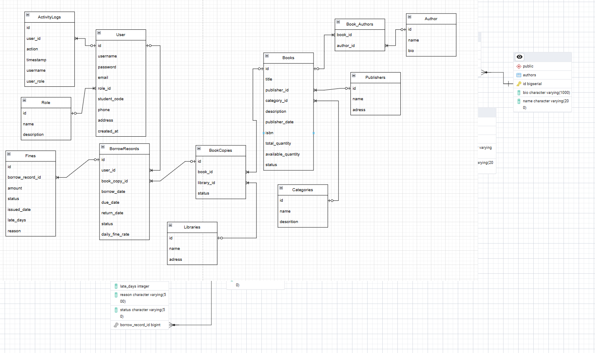
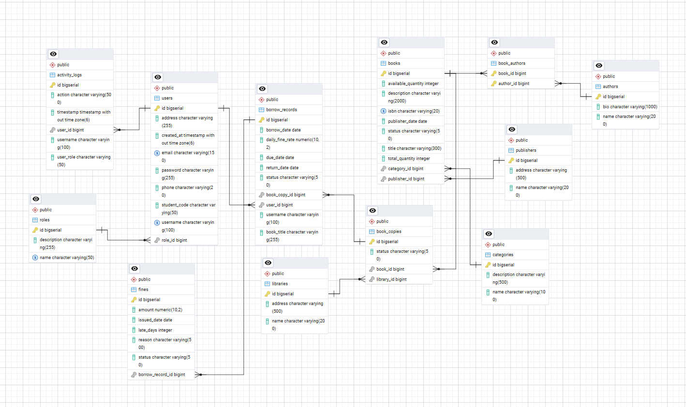

# Library Management System
## Система управления библиотекой

---

## Оглавление
1. [Описание проекта](#1-описание-проекта)
2. [Функции системы](#2-функции-системы)
3. [Модули и функциональности](#3-модули-и-функциональности)
4. [Технологии](#4-технологии)
5. [Назначение системы](#5-назначение-системы)
6. [Функциональные и нефункциональные требования](#6-функциональные-и-нефункциональные-требования)
7. [Архитектура базы данных](#7-архитектура-базы-данных)
8. [Ограничения целостности данных](#8-ограничения-целостности-данных)
9. [Триггеры](#9-триггеры)
10. [Индексы](#10-индексы)
11. [Реализация (Этап 3)](#11-реализация-этап-3)


---

## 1. Описание проекта

Система управления библиотекой — это веб-приложение, предназначенное для автоматизации процессов библиотечного обслуживания. Система позволяет управлять книгами, пользователями, процессами выдачи и возврата книг, а также штрафами за просрочку.

Проект разработан с использованием современных технологий: **Spring Boot** для backend и **React** для frontend, с базой данных **PostgreSQL**.

---

## 2. Функции системы

| Функция | Описание |
|---------|----------|
| Управление книгами | Добавление, редактирование, удаление книг |
| Управление пользователями | Регистрация, назначение ролей, удаление |
| Выдача книг | Запрос на выдачу, одобрение, отклонение |
| Возврат книг | Подтверждение возврата, автоматический расчёт штрафа |
| Управление штрафами | Просмотр, оплата, списание штрафов |
| Журнал активности | Логирование всех действий в системе |
| Аутентификация | JWT-токены для безопасного доступа |

---

## 3. Модули и функциональности

### 3.1 Администратор (Admin)

| Функциональность | Описание |
|------------------|----------|
| Управление пользователями | Просмотр всех пользователей, изменение ролей, удаление |
| Управление книгами | Полный CRUD для книг, авторов, категорий, издательств |
| Управление выдачей | Одобрение/отклонение запросов, подтверждение возврата |
| Управление штрафами | Просмотр всех штрафов, подтверждение оплаты, списание |
| Журнал активности | Просмотр всех действий в системе, удаление логов |

### 3.2 Сотрудник библиотеки (Staff)

| Функциональность | Описание |
|------------------|----------|
| Управление книгами | Добавление, редактирование, удаление книг |
| Управление выдачей | Одобрение/отклонение запросов на выдачу |
| Возврат книг | Подтверждение возврата книг |
| Управление штрафами | Просмотр штрафов, подтверждение оплаты |

### 3.3 Читатель (User)

| Функциональность | Описание |
|------------------|----------|
| Просмотр каталога | Поиск и просмотр доступных книг |
| Запрос на выдачу | Отправка запроса на выдачу книги |
| Мои книги | Просмотр текущих и прошлых выдач |
| Мои штрафы | Просмотр штрафов и их статуса |
| Профиль | Редактирование личных данных, смена пароля |

---

## 4. Технологии

### Backend
| Технология | Версия | Назначение |
|------------|--------|------------|
| Java | 17 | Язык программирования |
| Spring Boot | 3.x | Фреймворк для backend |
| Spring Security | 6.x | Аутентификация и авторизация |
| Spring Data JPA | 3.x | Работа с базой данных |
| JWT | - | Токены для аутентификации |
| Lombok | - | Сокращение boilerplate кода |
| Maven | - | Управление зависимостями |

### Frontend
| Технология | Версия | Назначение |
|------------|--------|------------|
| React | 18.x | Библиотека для UI |
| Vite | 5.x | Сборщик проекта |
| Tailwind CSS | 3.x | CSS фреймворк |
| Axios | - | HTTP клиент |
| React Router | 6.x | Маршрутизация |
| Lucide React | - | Иконки |

### База данных
| Технология | Назначение |
|------------|------------|
| PostgreSQL | Основная СУБД |

---

## 5. Назначение системы

### Проблема

Традиционное управление библиотекой сталкивается с рядом проблем:
- **Ручной учёт** книг приводит к ошибкам и потере данных
- **Отсутствие контроля** за сроками возврата книг
- **Сложность поиска** книг в каталоге
- **Неэффективное управление** штрафами и задолженностями
- **Отсутствие истории** операций и аудита

### Цель

Создание автоматизированной системы, которая:
- **Упрощает** процесс выдачи и возврата книг
- **Автоматизирует** расчёт штрафов за просрочку
- **Обеспечивает** быстрый поиск по каталогу
- **Ведёт журнал** всех операций для аудита
- **Разграничивает доступ** по ролям пользователей

---

## 6. Функциональные и нефункциональные требования

### Функциональные требования

| ID | Требование |
|----|------------|
| FR1 | Система должна позволять регистрацию новых пользователей |
| FR2 | Система должна поддерживать три роли: Admin, Staff, User |
| FR3 | Пользователи могут искать книги по названию, автору, категории |
| FR4 | Читатели могут отправлять запросы на выдачу книг |
| FR5 | Staff/Admin могут одобрять или отклонять запросы |
| FR6 | Система автоматически рассчитывает штраф при просрочке |
| FR7 | Система ведёт журнал всех действий пользователей |
| FR8 | Admin может управлять пользователями и их ролями |

### Нефункциональные требования

| ID | Требование |
|----|------------|
| NFR1 | Время отклика API не более 2 секунд |
| NFR2 | Пароли хранятся в зашифрованном виде (BCrypt) |
| NFR3 | Система должна работать в современных браузерах |
| NFR4 | Интерфейс должен быть интуитивно понятным |
| NFR5 | Система должна поддерживать одновременную работу нескольких пользователей |

---

## 7. Архитектура базы данных

### ER-диаграмма (Сущности)






### Таблицы базы данных

| Таблица | Описание |
|---------|----------|
| roles | Роли пользователей (ADMIN, STAFF, USER) |
| users | Пользователи системы |
| books | Книги в каталоге |
| book_copies | Экземпляры книг в библиотеках |
| categories | Категории книг |
| authors | Авторы книг |
| book_authors | Связь книг и авторов (M:N) |
| publishers | Издательства |
| libraries | Филиалы библиотеки |
| borrow_records | Записи о выдаче книг |
| fines | Штрафы за просрочку |
| activity_logs | Журнал активности |

---

## 8. Ограничения целостности данных (Constraints)

### Users
```sql
ALTER TABLE users
    ADD CONSTRAINT users_username_unique UNIQUE (username),
    ADD CONSTRAINT users_email_unique UNIQUE (email);
```
**Назначение:** Гарантирует уникальность логина и email для каждого пользователя.

### Books
```sql
ALTER TABLE books
    ADD CONSTRAINT books_isbn_unique UNIQUE (isbn),
    ADD CONSTRAINT books_total_quantity_check CHECK (total_quantity >= 0),
    ADD CONSTRAINT books_available_quantity_check 
        CHECK (available_quantity >= 0 AND available_quantity <= total_quantity);
```
**Назначение:** Уникальный ISBN, количество книг не может быть отрицательным.

### Roles
```sql
ALTER TABLE roles
    ADD CONSTRAINT roles_name_unique UNIQUE (name);
```
**Назначение:** Нельзя создать две одинаковые роли.

### Borrow Records
```sql
ALTER TABLE borrow_records
    ADD CONSTRAINT borrowrecords_due_after_borrow CHECK (due_date >= borrow_date),
    ADD CONSTRAINT borrowrecords_return_after_borrow 
        CHECK (return_date IS NULL OR return_date >= borrow_date),
    ADD CONSTRAINT borrowrecords_fine_rate_check CHECK (daily_fine_rate >= 0);
```
**Назначение:** Логическая проверка дат и ставки штрафа.

### Fines
```sql
ALTER TABLE fines
    ADD CONSTRAINT fines_amount_check CHECK (amount >= 0),
    ADD CONSTRAINT fines_latedays_check CHECK (late_days >= 0);
```
**Назначение:** Сумма штрафа и дни просрочки не могут быть отрицательными.

---

## 9. Триггеры

### Уменьшение количества при выдаче
```sql
CREATE OR REPLACE FUNCTION decrease_available_quantity()
RETURNS TRIGGER AS $$
BEGIN
    IF (SELECT available_quantity FROM books WHERE id = NEW.book_id) <= 0 THEN
        RAISE EXCEPTION 'Book is not available';
    END IF;
    
    UPDATE books
    SET available_quantity = available_quantity - 1
    WHERE id = NEW.book_id;
    
    RETURN NEW;
END;
$$ LANGUAGE plpgsql;

CREATE TRIGGER trigger_decrease_quantity
BEFORE INSERT ON book_copies
FOR EACH ROW
EXECUTE FUNCTION decrease_available_quantity();
```
**Назначение:** При выдаче книги автоматически уменьшает доступное количество.

### Увеличение количества при возврате
```sql
CREATE OR REPLACE FUNCTION increase_available_quantity()
RETURNS TRIGGER AS $$
BEGIN
    IF NEW.return_date IS NOT NULL AND OLD.return_date IS NULL THEN
        UPDATE books
        SET available_quantity = available_quantity + 1
        WHERE id = (SELECT book_id FROM book_copies WHERE id = NEW.book_copy_id);
    END IF;
    
    RETURN NEW;
END;
$$ LANGUAGE plpgsql;

CREATE TRIGGER trigger_increase_quantity
AFTER UPDATE ON borrow_records
FOR EACH ROW
EXECUTE FUNCTION increase_available_quantity();
```
**Назначение:** При возврате книги автоматически увеличивает доступное количество.

> **Примечание:** В текущей реализации логика изменения количества книг выполняется на уровне приложения (в BorrowService.java) для лучшего контроля и обработки ошибок.

---

## 10. Индексы

```sql
-- Поиск книг по названию
CREATE INDEX idx_books_title ON books(title);

-- Поиск авторов по имени
CREATE INDEX idx_authors_name ON authors(name);

-- Поиск книг по категории
CREATE INDEX idx_books_category ON books(category_id);

-- Поиск записей выдачи по пользователю
CREATE INDEX idx_borrow_records_user ON borrow_records(user_id);

-- Поиск записей выдачи по статусу
CREATE INDEX idx_borrow_records_status ON borrow_records(status);
```
**Назначение:** Ускорение поиска и фильтрации данных.

---

## 11. Реализация (Этап 3)

### Структура проекта

```
library-management/
├── backend/
│   └── src/main/java/com/library/
│       ├── controller/     # REST API контроллеры
│       ├── service/        # Бизнес-логика
│       ├── repository/     # JPA репозитории
│       ├── entity/         # Сущности БД
│       ├── dto/            # Data Transfer Objects
│       ├── security/       # JWT, Security Config
│       └── config/         # Конфигурации
│
└── frontend/
    └── src/
        ├── components/     # React компоненты
        ├── pages/          # Страницы
        ├── services/       # API сервисы
        └── context/        # React Context
```

### Основные компоненты Backend

| Компонент | Назначение |
|-----------|------------|
| SecurityConfig | Настройка Spring Security, JWT фильтры |
| JwtUtil | Генерация и валидация JWT токенов |
| GlobalExceptionHandler | Централизованная обработка ошибок |
| DataInitializer | Инициализация начальных данных |

### API Endpoints

| Метод | Endpoint | Описание | Доступ |
|-------|----------|----------|--------|
| POST | /api/auth/register | Регистрация | Все |
| POST | /api/auth/login | Авторизация | Все |
| GET | /api/books | Список книг | Все авторизованные |
| POST | /api/books | Добавить книгу | Staff, Admin |
| DELETE | /api/books/{id} | Удалить книгу | Staff, Admin |
| POST | /api/borrows | Запрос на выдачу | User |
| PUT | /api/borrows/{id}/approve | Одобрить выдачу | Staff, Admin |
| PUT | /api/borrows/{id}/return | Подтвердить возврат | Staff, Admin |
| GET | /api/fines | Список штрафов | Staff, Admin |
| PUT | /api/fines/{id}/pay | Оплата штрафа | Staff, Admin |
| GET | /api/activity-logs | Журнал активности | Admin |
| GET | /api/users | Список пользователей | Admin |

### Workflow выдачи книги

```
┌──────────┐     ┌──────────┐     ┌──────────┐     ┌──────────┐
│  User    │     │  PENDING │     │ BORROWING│     │ RETURNED │
│ Request  │────►│ (Waiting)│────►│ (Active) │────►│ (Done)   │
└──────────┘     └──────────┘     └──────────┘     └──────────┘
                      │                 │
                      ▼                 ▼
                 ┌──────────┐     ┌──────────┐
                 │ REJECTED │     │  OVERDUE │
                 └──────────┘     │ + Fine   │
                                  └──────────┘
```

### Особенности реализации

1. **Soft Delete** — При удалении пользователя или книги сохраняется история в borrow_records (username, book_title хранятся отдельно)

2. **Activity Logging** — Все важные действия записываются в журнал:
   - Регистрация пользователей
   - Запросы на выдачу книг
   - Одобрение/отклонение запросов
   - Возврат книг
   - Оплата/списание штрафов
   - Административные действия

3. **JWT Authentication** — Безопасная аутентификация с использованием токенов

4. **Role-based Access Control** — Разграничение доступа по ролям через @PreAuthorize

---

## 12. Установка и запуск

### Требования
- Java 17+
- Node.js 18+
- PostgreSQL 14+
- Maven

### Backend
```bash
cd backend
# Настроить application.properties (БД)
mvn spring-boot:run
```

### Frontend
```bash
cd frontend
npm install
npm run dev
```


*Library Management System © 2026*
